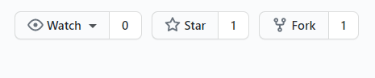
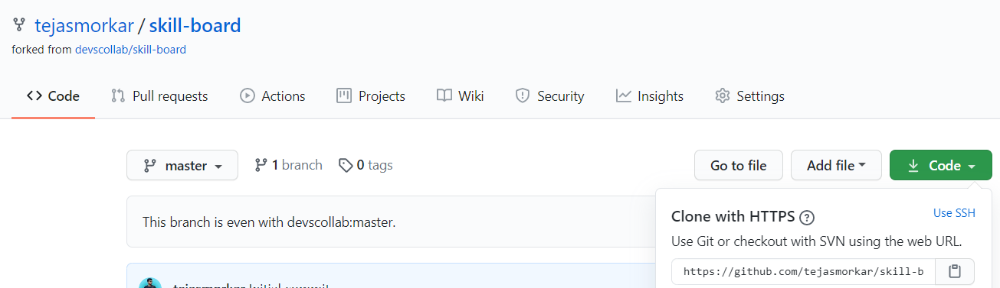

# Contribution Guidelines

There are some guildelines which everyone should follow while contributing to this opensource project. While working in large teams, it is necessary to follow these steps to avoid any conflicts in the code and continue a smooth flow of collaboration amongst the developers.

**Watch this Video if you are new to GitHub - [YouTube Link](https://youtu.be/HbSjyU2vf6Y)**

## 1. Fork the Repository

First step is to fork this repository (devscollab/skill-board) to your GitHub account. You can do this by clicking on the Fork button provided in the top right corner of the repo page. 

Also, start and watch the reposotory to receive all the updates directly to your mail.

**How to Fork a Repository? - [YouTube Link](https://youtu.be/HbSjyU2vf6Y?t=101)**

## 2. Clone the forked repo to your system

Clone the repository that you just forked into your account.
Be careful to clone the forked repo (your-username/skill-board) and not the main repo (devscollab/skill-board) as making direct changes to the main repo will result in conflict of code and lack of co-ordination as we proceed further.

The forked repository will have your username in the top left corner and the clone link will also contain your username (https://github.com/your-username/skill-board.git).

**How to Clone a forked repo? - [YouTube Link](https://youtu.be/HbSjyU2vf6Y?t=134)**

## 3. Add the main repo as remote upstream

Now, you have the repository on your system and you are ready to make changes. But what if someone else changes the same thing that you just did?

To avoid any conflicts, you need to pull all the changes from the main repository. 

So, after cloning the forked repository (your-username/skill-board) to your system, use the command `git remote add upstream https://github.com/devscollab/skill-board.git` to point to the main repository. You only need to do this once.

Now, after making any changes to your project on the system, follow these simple steps to push your work to the repository:

`git add .`

`git commit -m "Commit Message"`

`git pull upstream master` *This command checks for any conflicts with the main repo. Go through the conflicts and make changes, if required.*

`git push`

**How to set up a Remote Repo - [YouTube Link](https://youtu.be/-zvHQXnBO6c)**

## 4. Create a pull request

After pushing the changes to your forked repository (your-username/skill-board), all you have to do is create a new pull request from your account by simply clicking on the *Pull Request* button.

> NOTE:
> If you are some commits behind of devscollab:master then you need to first git pull upstream master from the system, push it to your forked repository and then create the Pull Request.

Give a detailed and useful explaination of what you did in the comments of pull requests and someone from the maintainers or team leads will review the code and accept the pull request or ask you to change some things before merging it.

**How to Create a Pull Request? - [YouTube Link](https://youtu.be/HbSjyU2vf6Y?t=297)**
