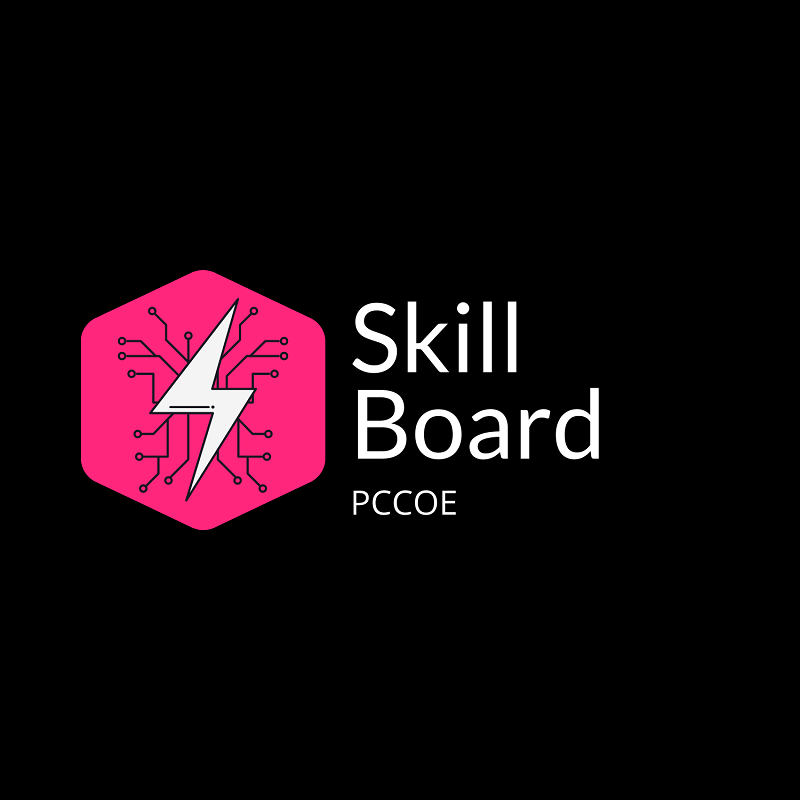

# Skill Board

   

 <!-- .element height="30%" width="30%" -->

Skill Board is a web application where the students can showcase their skills & experience and show the availability & interest in receiving new opportunities to work on new projects and internships. Faculties and recruiters can go through this skill board to view the projects of students with the required skills and can contact the students directly for discussing any particular opportunity.

It is like a job listing page but for students from a particular college.

This is an open source project and everyone is free to contribute. Right now we are building the frontend on this repo. You can find the API for this at https://github.com/devscollab/skill-board-api

## Table of Content

[How to contribute](#how-to-contribute)

[Connect with us](#connect-with-us)

## How to contribute

There are some guildelines which everyone should follow while contributing to this opensource project. While working in large teams, it is necessary to follow these steps to avoid any conflicts in the code and continue a smooth flow of collaboration amongst the developers.

[Check the Contribution Guidelines](./CONTRIBUTING.md)

### Best Practices to follow

1. Code organisation becomes easier if everyone in the team follows a certain naming pattern.
For example, to make organisation easier, we should follow a simple and logical naming pattern for CSS Classes
in the format : pagenameElementName
Example :
   - The Top bar for this page (listings page) can be named <b>.lisitingTopBar</b>
   - The profile cards for this page (listings page) can be named <b>.lisitingProfileCards</b>  
This helps when the css files become 1000s of lines long by the end of the project.

2. While adding any element, make sure it is responsive and its contents fit on all screen sizes.
Users of SkillBoard will use it from all kinds of deivces like Small Mobiles, Large Mobiles, Tablets, Desktops,
and in different orientations like portrait and landscape. Always consider this.
You can test your page on other screen sizes by pressing F12 in chrome browser, and
selecting a mobile view from the list of available devices.

3. Read the comments in the code for more hints.

## Connect with us

If you are facing any difficulties in managing or contributing to this project, please discuss it on the Discord Server in the #skill-board channel.

If there is any issues in using the skill board, contact us via email at [devscollab@gmail.com](mailto:devscollab@gmail.com).

For reporting bugs or requesting features, create a new issue in this repository with the proper template.

Maintained by - [@tejasmorkar](https://github.com/tejasmorkar) and [@suyashsonawane](https://github.com/suyashsonawane)
